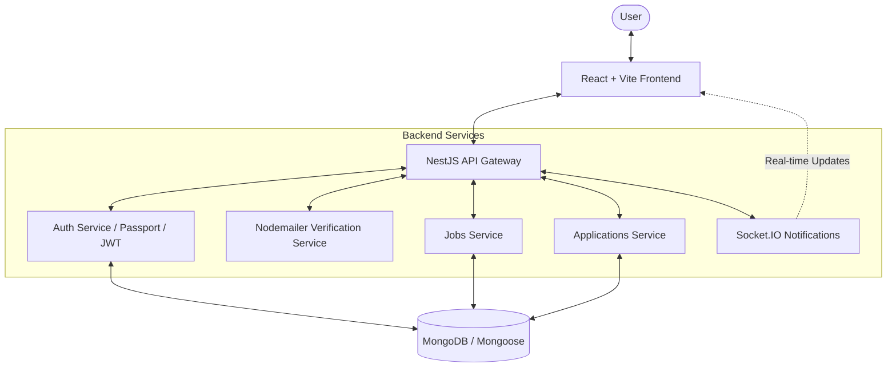

# Job Connect — Full-Stack Job Portal 🚀

[](https://nestjs.com/)
[](https://reactjs.org/)
[](https://www.mongodb.com/)
[](https://tailwindcss.com/)

A production-ready job portal featuring MongoDB persistence, Google OAuth, company identity verification, real-time notifications, and a modern TypeScript-first architecture.

---

## 🏗 System Architecture

The following diagram illustrates the interaction between the Frontend, Backend, and Database:



---

## ✨ Features

- **Multi-Role Support**: specialized dashboards for **Job Seekers**, **Employers**, and **Admins**.
- **Social Authentication**: Google OAuth integration for Job Seekers (local credentials for Employers).
- **Company Identity Verification**: Secure email-based registration flow with token verification via Nodemailer.
- **Advanced UI/UX**: Premium landing page with **Hero sections**, **Feature highlights**, **Testimonials**, and **Brand slider**.
- **Persistent Storage**: MongoDB with Mongoose schemas for Users, Jobs, and Applications.
- **Real-time Notifications**: Socket.IO alerts for job postings, application status updates, and new applicant notifications.
- **Enterprise-Grade Auth**: JWT-based session management with refresh token capability.
- **Modern Tech Stack**: Built with `shadcn/ui`, `Tailwind CSS`, `Framer Motion`, and `Lucide` icons.

---

## 📥 Getting Started

### 1. Prerequisites
- **Node.js**: v18+
- **MongoDB**: Local community server or Atlas URI.
- **Google Cloud Console**: OAuth Client ID/Secret.
- **Email Gateway**: SMTP server details (Gmail App Passwords or similar).

### 2. Configuration
Create a `.env` file in the **`backend`** directory:
```env
# Database & Auth
MONGO_URI=your_mongodb_uri
JWT_SECRET=your_secret_key
JWT_EXPIRES_IN=1d

# Google OAuth
GOOGLE_CLIENT_ID=your_google_id
GOOGLE_CLIENT_SECRET=your_google_secret
GOOGLE_CALLBACK_URL=http://localhost:5000/api/auth/google/callback

# Email Configuration (Nodemailer)
MAIL_HOST=smtp.gmail.com
MAIL_PORT=587
MAIL_USER=your_email@gmail.com
MAIL_PASS=your_app_password
MAIL_FROM="NexusCore Admin <admin@nexuscore.com>"

# App URLs
FRONTEND_URL=http://localhost:8080
PORT=5000
```

### 3. Installation & Run
You must open TWO separate terminals:

#### **Terminal 1: Backend**
```bash
cd backend
npm install
npm run start:dev
```

#### **Terminal 2: Frontend**
```bash
cd frontend
npm install
npm run dev
```

---

## 📦 Project Structure

```text
├── backend/
│   ├── src/
│   │   ├── auth/           # JWT & Google OAuth Logic
│   │   ├── common/         # Schemas, Guards & Mail Service
│   │   ├── companies/      # Company Verification Logic
│   │   ├── jobs/           # Job Management
│   │   ├── applications/   # Application Tracking
│   │   └── notifications/  # WebSocket Gateway
│   └── .env                # Server Credentials
├── frontend/
│   ├── src/
│   │   ├── components/     # UI Design System (Hero, Slider, etc.)
│   │   ├── services/       # API Communications
│   │   ├── contexts/       # Auth & State Management
│   │   └── pages/          # Dashboard & Public Routes
└── README.md               # Documentation Root
```

---

## 🛡 Security Rules
- **Identity Verification Protocol**: All companies must verify their email via a secure token-based flow before posting jobs.
- **Access Control**: Roles are strictly checked at the API level (e.g., Only employers can post jobs).
- **Google OAuth**: Restricted only to Job Seekers (Employers must use business email/password).
- **Encryption**: All passwords are hashed using `bcrypt` (10 rounds).
- **Data Protection**: Sensitive fields (like passwords) are never returned in JSON responses.

